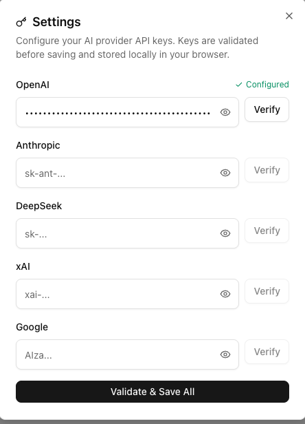

# EquaMotion

<p align="center">
  
</p>
<p align="center">
    AI-powered math animation generator. Describe a math concept and get a Manim video animation.
</p>
<p align="center">
  
  
  
  
</p>

---

<p align="center">
   
</p>

## Architecture

- **`web/`** — Next.js frontend (chat UI, model selection, video preview)
- **`api/`** — Python backend (renders Manim scripts to MP4 videos)

## Prerequisites

- [Node.js](https://nodejs.org/) 18+
- [pnpm](https://pnpm.io/) (or npm)
- [Python](https://www.python.org/) 3.11+
- [ffmpeg](https://ffmpeg.org/), Cairo, Pango, LaTeX — required by [Manim](https://www.manim.community/) (see [api/README.md](api/README.md) for per-OS instructions)
- [Docker](https://www.docker.com/) (optional — for containerized setup)

## Quick Start

### Option 1: Shell

```bash
chmod +x start.sh
./start.sh
```

This will set up both services (venv + npm install), generate a shared API key, and start them.

### Option 2: Make

```bash
make setup   # install dependencies
make dev     # start
make stop    # stop
```

### Option 3: Manual Setup

#### 1. API (Python)

```bash
cd api

# Create virtual environment
python3 -m venv venv
source venv/bin/activate    # Windows: venv\Scripts\activate

# Install dependencies
pip install -r requirements.txt

# Run
python main.py
```

> **System dependencies required:** ffmpeg, cairo, pango, LaTeX.
> See [api/README.md](api/README.md) for install instructions per OS.

#### 2. Web (Next.js)

```bash
cd web

# Install dependencies
npm install    # or: pnpm install

# Run
npm run dev # or: pnpm run dev
```

The web app will be at `http://localhost:3000`.

---

## Setting Up AI Provider Keys

AI provider API keys (OpenAI, Anthropic, DeepSeek, xAI, Google) are configured directly in the app through the **Settings** modal — no environment files needed.

Click the **Settings** icon in the UI to open the modal, enter your API keys, and hit **Validate & Save All**. Keys are validated before saving and stored locally in your browser.

<p align="center">
  
</p>

---

## License

[MIT](LICENSE)
